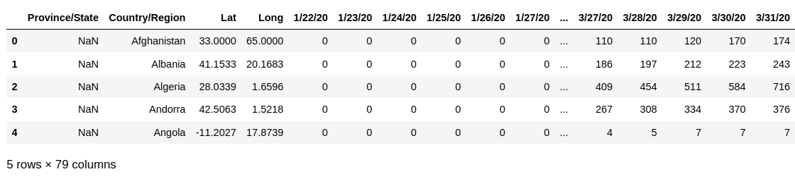
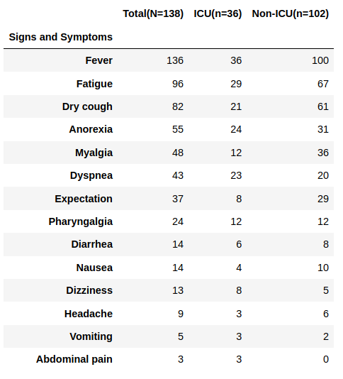

# Visualization and Analysis of COVID-19 World Data  
# Anton Korolev
[LinkedIn](https://www.https://www.linkedin.com/in/anton-korolevb558/) | [GitHub](https://https://www.github.com/VHTATAH)
## Table of Contents
1. [Overview](#Overview)
2. [Data](#Data)
3. [Exploration](#Exploration)
4. [Statistical Analysis](#Statistical%20Analysis) 
5. [Conclusions](#Conclusions) 
6. [Future Analysis](#Future%20Analysis)
---
## Overview
Coronavirus disease 2019 (COVID-19) is a respiratory illness that can spread from person to person. The virus that causes COVID-19 is a novel coronavirus that was first identified during an investigation into an outbreak in Wuhan, China. With numbers of confirmed cases growing every day it is hard to quickly estimate the situation when looking at the data in the table format. As infection rates swell across the world, hospitals capacities are pushed to the limits. 
In this project, the spread of the virus will be visualized using charts and graphs. An example of patient evaluation based on the  symptoms will be introduced.

## Data
Since the corona erupted into our world, research institutes and governments have released many databases publicly to allow research groups (and independent individuals) to analyze the data around the corona’s spread. These databases are scattered under numerous initiatives and sources. The data for the project was downloaded from data.humana.org web site in a form of csv files and Excel sheets.

## Exploration 
This section contains plots and tables that were used in the project

## Statistical Analysis 

---
H0: The Dizziness and ICU admission are independent.
H1: The Dizziness and ICU admission are NOT independent 
Alpha = 0.05
p value =  0.006
0.006 < 0.05 hence reject H0

------

H0: The Dry Cough and ICU admission are independent.
H1: The Dry Cough and ICU admission are NOT independent 
Alpha = 0.05
p value =  0.887
0.887 > 0.05 hence fail to reject H0

## Conclusions 
1. The number of people getting infected with COVID19 in United States is the highest in the world 

2. China is the best at fighting the virus among the top 10 countries with the most number of confirmed infected cases 

3. If two patients infected with COVID-19 show up at the hospital with the limited number of beds in Intensive Care Unit. The one who feels dizzy should be admitted to ICU first.

## Future Analysis 
The number of upcoming infected cases could be predicted using linear regression  model in the future analysis 

