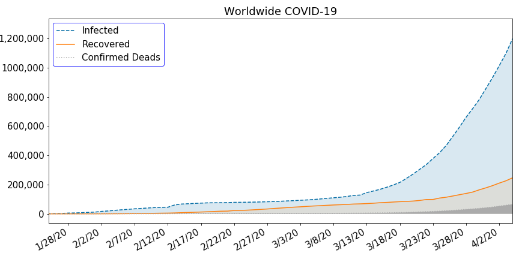
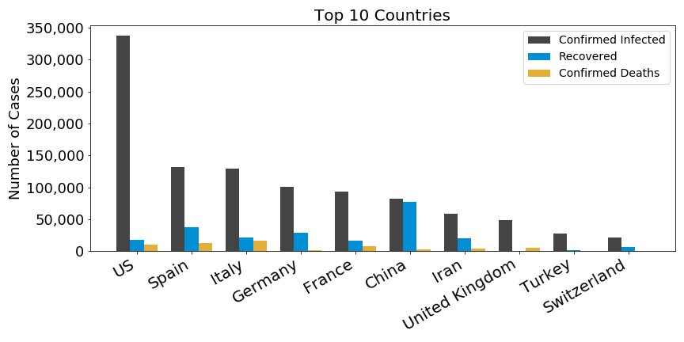
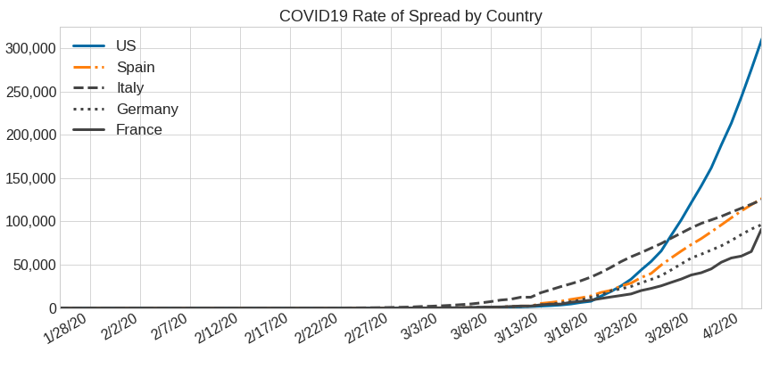
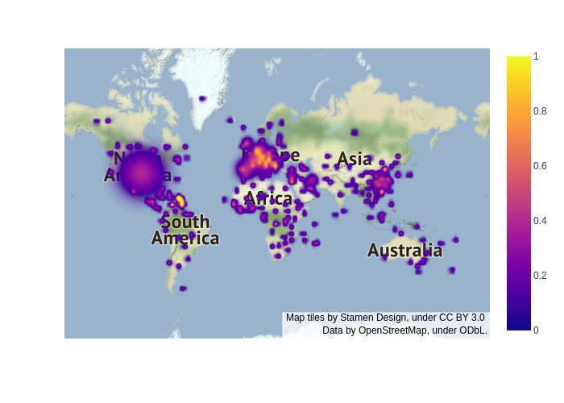
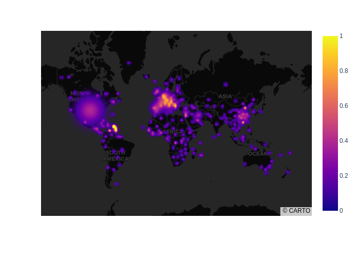

# COVID-19
Visualization and Analysis of COVID-19 World Data  
---
## Overview
Coronavirus disease 2019 (COVID-19) is a respiratory illness that can spread from person to person. The virus that causes COVID-19 is a novel coronavirus that was first identified during an investigation into an outbreak in Wuhan, China. With numbers of confirmed cases growing every day it is hard to quickly estimate the situation when looking at the data in the table format. As infection rates swell across the world, hospitals capacities are pushed to the limits. 
In this project, the spread of the virus will be visualized using charts and graphs. An example of patient evaluation based on the  symptoms will be introduced.

## Data
Since the corona erupted into our world, research institutes and governments have released many databases publicly to allow research groups (and independent individuals) to analyze the data around the corona’s spread. These databases are scattered under numerous initiatives and sources. The data for the project was downloaded from data.humana.org web site in a form of csv files and Excel sheets.

## Exploration 
This section contains the plots that were used in the project

